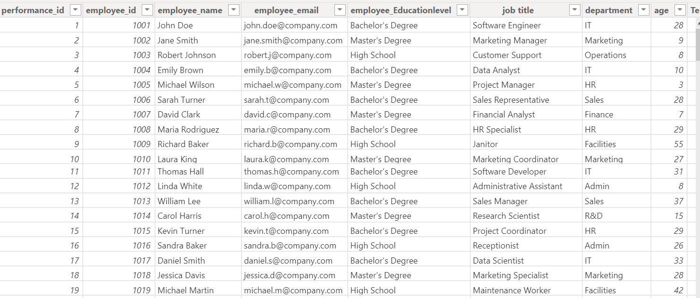

# Employee-Performance-Analysis
Through performance analysis, this study determines how the department, education, pay, completed tasks, and experience affect an employee's performance. It offers insights and suggestions to improve output, morale, and overall performance, boosting business efficiency and profitability through data cleansing, EDA, and visualization.

            

## Introduction:
This project involves the analysis of employee performance measures. The research investigates several variables, including departmental performance, the connection between education and performance, the impact of pay, completed projects, and experience. The goal of the analysis is to offer practical advice on how to improve staff morale, productivity, and general performance.

 

__Disclaimer:__ _All datasets and reports do not represent any company, institution, or country, just dummy datasets to demonstrate data analysis capabilities._
## Skills/Concepts Demonstrated
The following data analysis concepts were incorporated:
- Data Cleaning and Preprocessing
- Exploratory Data Analysis (EDA)
- Data Visualization
- Statistical Analysis

## Problem Statement:
1.	Which department performs the best?
2.	Is performance related to education?
3.	Does salary influence performance?
4.	Does the number of projects completed increase performance?
5.	Does experience improve performance?
   
## Data Analysis Process:
#### Data Cleaning:
- Ensure data integrity and consistency.
- Handle missing values and outliers.

### Data Exploration:

- Understand the structure and distribution of the data.
- Generate summary statistics and initial visualizations.

## Power Query:

The power Query is the step process of data validation and exploration.

## Modelling:

The model is a star schema from a single employee data table with no table relationships.

## Visualization:
The report comprises multiple pages:
1.	Performance Rating by Department
2.	Performance Rating by Education
3.	Performance Rating by Tenure
4.	Performance Rating by Projects Completed
5.	Project Completed and Employee ID
6.	Salary Range and Performance Rating

## THE DASHBOARD

## Analysis:
Departmental Performance:

- The department with the highest average performance rating is **Sales**
  
Relationship Between Performance and Education:

- Employees with a Masters's degree have the highest average performance rating.

Influence of Salary on Performance:

- High-income employees tend to have a better performance rating
  
Projects Completed and Performance:

- Completing more projects is associated with a higher performance rating

Experience and Performance:

- Employees with more years of tenure generally have a better performance rating

## Conclusion and Recommendations:
- The analysis of employee performance data provided valuable insights into departmental performance, the relationship between performance and education, and the impact of salary on job performance.
- By identifying areas for improvement and providing actionable recommendations, the company can enhance employee productivity, morale, and overall performance, leading to increased efficiency and profitability.
## Recommendations:
- **Improve Instructional Initiatives:**
_To improve skills and productivity, allocate funds to departmental performance ratings that are lower._
- **Encourage Learning Opportunities:**
_To enhance performance and further their careers, employees should be encouraged and assisted in obtaining additional training and certifications._
- **Modify Pay Structures:**
_Examine and modify pay systems to guarantee equitable remuneration, inspire workers, and match pay to performance._
- **Boost Involvement in the Project:**
_Give staff members the chance to work on more projects to increase their sense of accomplishment and boost productivity._
- **Make Use of Skilled Staff:**
_Make use of tenured staff members' knowledge by including them in training and mentoring initiatives. This will allow the use of their experience and enhance team performance._

            

## Additional Information:
- Explored departmental performance, the relationship between performance and education, salary influence, projects completed, and experience.
- Visualized key metrics to provide actionable insights for performance improvement.
- The analysis led to recommendations that helped enhance employee productivity, morale, and overall performance.
